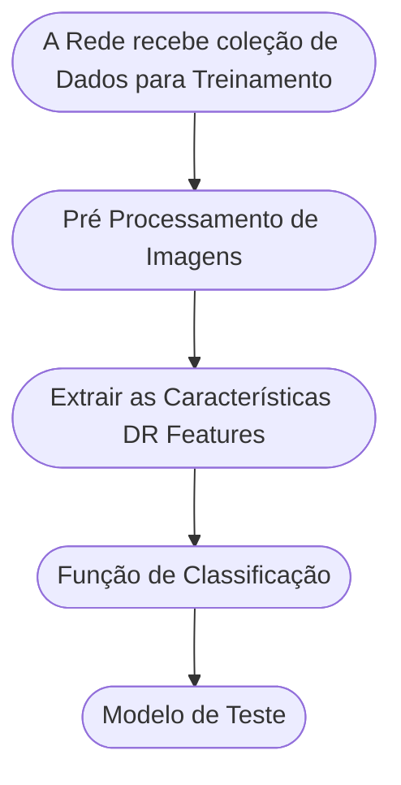

<h1>
     
    Rede de Classificação Inception-V3
</h1>

## Arquitetura 

```mermaid
flowchart TD
    A([A Rede recebe coleção de Dados para Treinamento]) --> B([Pré Processamento de Imagens])
    B --> C([Extrair as Características DR Features])
    C --> D([Função de Classificação])
    D --> E([Modelo de Teste])
```

## Transfer Learning 

